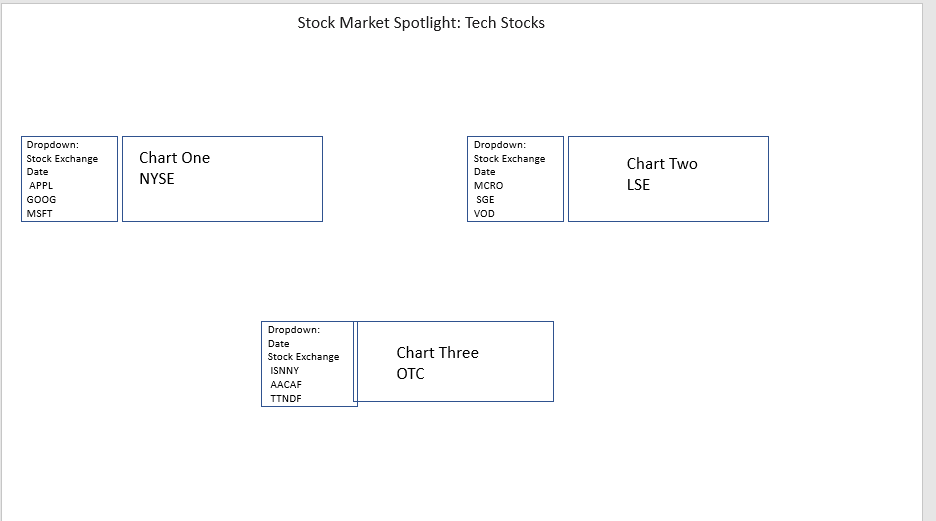

### Project Title
## Stock Market Spotlight: Tech Stocks
<a href="https://stockmarketspotlight.herokuapp.com">Deployed Application</a> 
  https://stockmarketspotlight.herokuapp.com/
 
<a href="https://github.com/armywalrus/Stock-Market-Spotlight-Tech-Stocks.git">Repo</a>

## Team Members
Zach Herington
Molly Oesterling
Chris Waycott
Tomorrow Rose

## Project Description/Outline
We are going to tell a visual story using data from the Technology stocks on the New York Stock (NYSE), and the Over The Counter (OTC), London Stock Exchange (LSE) by creating a dashboard page to include three views of user-driven interaction visualizations. (ie. menus, dropdowns, textboxes). We will use Chartjs library to build user interfaces, to add to the visualization. For our project we will use Python-Flask - powered by RESTFUL API, HTML/CSS, JavaScript, and a MongoDB database. We will choose three different stocks, Microsoft, Google and Apple and analyze each one. Our project will be powered by a data set with at least 100 records. Change from stock Open price to Closed Price. We will use filters for the various stock exchanges. 

## Technologies
This project will be created with:

* Python-Flask/RESTFUL API
* HTML/CSS
* JavaScript
* MongoDB database

## Datasets to Be Used
* New York Stock (NYSE)dataset
* Over The Counter (OTC),
* London Stock Exchange (LSE)

<a href="https://github.com/armywalrus/Stock-Market-Spotlight-Tech-Stocks/blob/main/All%20Stocks.csv">Data</a>

## Visualizations

Inspiration:

* Stock Price (line)
* Open and Closed Stock Prices (line)
* Stock Exchage Dropdown(filter/button)
* Tech Stocks(filter/buttons)

## Tasks Breakdown
* Gather data from stock exchange for visualizations
* Create charts
* Create Database
* Build dashboard
* Acclimate to Chartjs
